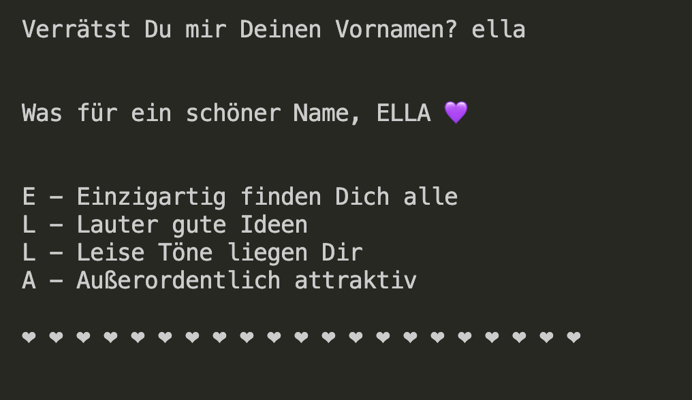

# PB-Abschlussprojekt/ Programming Basics Final Project
Abschlussarbeit für das Modul Programing Basics der DCI / Console only project, course work  

### calculator   
Bibliothek mit einigen Rechenoperationen /
A library which contains useful calculation functions based on common formulas (aspect ratio, percentage calculation, etc.)

### Akrostichon - acrostic poem generator (german)  

Dependencies: Akrostichon uses prompt sync https://www.npmjs.com/package/prompt-sync
